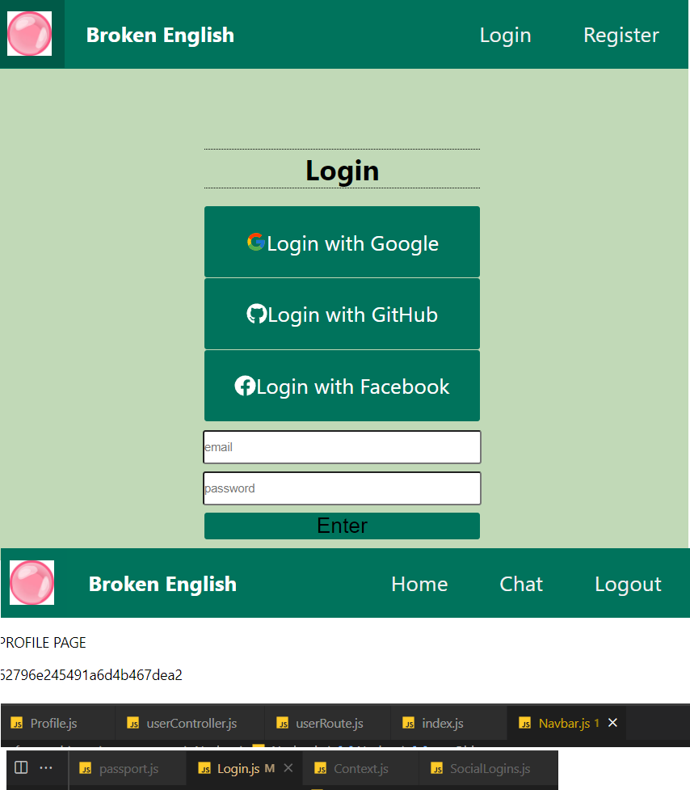

# Getting Started with Create React App

This project is going to be an on-going learning experience to build a peer to peer chat application.

This app is designed to have a conversation between one another but allow the user to see a translated message from Google Translate API

The sender will have the choice to send the message via a translation or in english (or whatever they would normally send). The receiver will see either of the message sent.

Due to the API being not really free to translate, the original idea will be stunted until I can afford it.

The sender will send it (most likely in English for now), and the receiver will have the option of receiving the input in their language of choice (whatever Google can offer/translate successfully).

The receiver will have a "tolerance" bar to set the level of translated messages (beginner, intermediate, advanced, fluent). My hopes is that when the messages goes through to the receiver, the function will randomly select (at first) words in the sent message and translate them based on the tolernace set, hence, Broken English.

# Development Pictures...

### Update 1:

My first message translated using RapidAPI - Google Translate. Unforunately this is limited to 500 calls / month... so this may get annoying...

### Update 2:

I attempted to use socketio and i finished what I wanted to do. I can translate and send any message desired with GoogleTranslate API. My next action is to figure out user logins properly and tie it in with socketio

### Update 3:

The attempt is complete and I have my chat app. There's a caveat, the login/register isn't really functional yet and I'm figuring out how to do the backend now. I think the frontend is good to start!

### Update 4:

So because I'm out of my quota for RapidAPI's 500 API call quota... and I'm a poor learner, I decided to use https://www.npmjs.com/package/@vitalets/google-translate-api which translates my sentences at an unlimited rate! I think its a WIN WIN. I changed my code a bit to make sure I can still call Google Translate's API, so I just have to change a couple of things if I want to switch back. I don't think I'll be going back anytime soon... 500 api calls is a joke, and free is free!

### Update 5:

I've officially let the sender send a message either translated or in english. I've also let the receiver have a tolerance from 0 to 10 words OR 25%, 50%, 100% translation. I've brought back my initial idea since I'm using this new API for Google Translate. Thank goodness it's unlimited and free. There are times when the translation isn't perfect but I have not found a way to translate with Grammar which is a big issue. This is also tested using French.... Other languages like the Asian languages may not be so hot.

### Update 6:

I can now talk to my mom! WOO!!! I can set my own languages, while my mom can set hers. She'll see it in Vietnamese (you can choose your own language) and she can text in Vietnamese but I'll read it in English!!!

### Update 7:

Login and Logout features are now working to some smooth degree of uncertainty, but there's useContext and passport using oauth2 methods... I've also conditionally rendered the menu items. Next step is to add a fancy home page now with some user details. Maybe after that we'll get back to the chat features and create a chat app like facebook messenger or discord (chat rooms...)

Helpful links: https://www.youtube.com/watch?v=cD17CYA1dck&t

